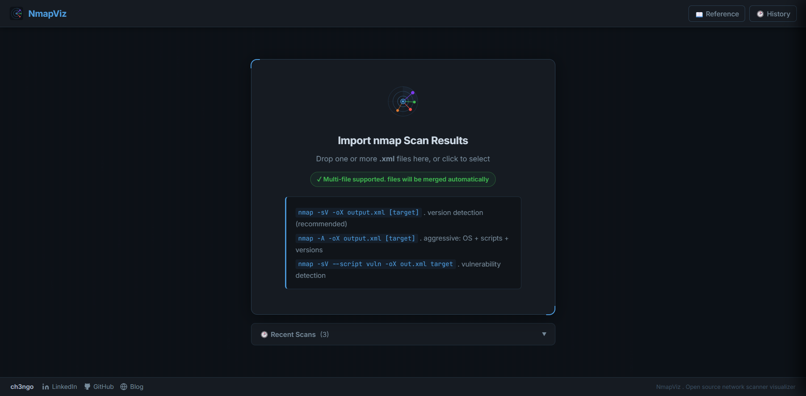
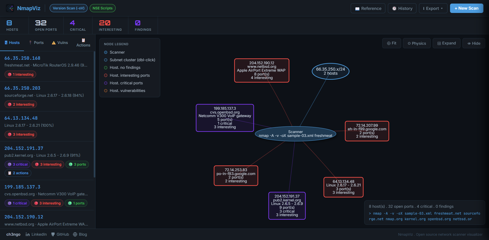
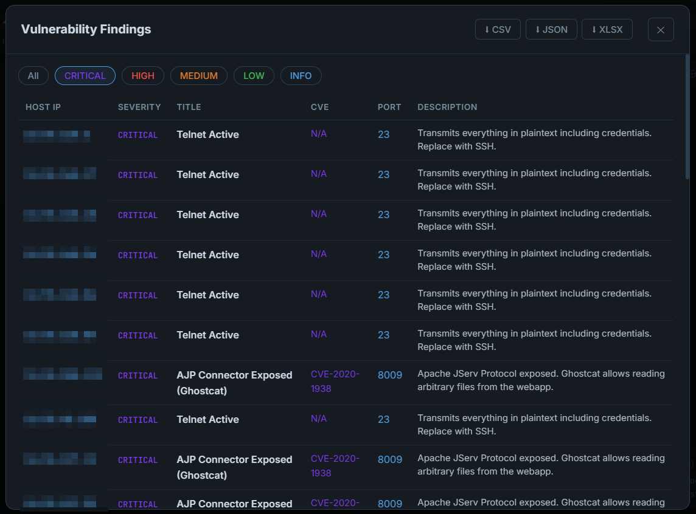
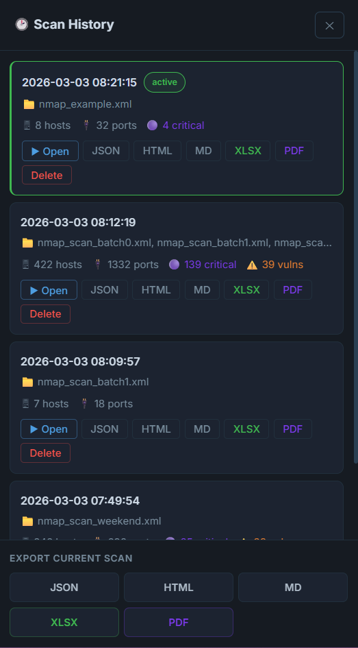

<div align="center">


# NmapViz

**A graphical visualizer for nmap scan results**

[](https://hub.docker.com)
[](https://python.org)
[](https://flask.palletsprojects.com)

Drop your nmap XML files in. Instantly see your network as an interactive node graph with automatic vulnerability detection, subnet clustering, and exportable reports.

</div>

⚠️ **Disclaimer**
This project is a work in progress, built hand-in-hand with Claude Code. To be honest, Claude did most of the heavy lifting while I provided moral support. If it breaks, blame the bot, but if it’s brilliant, I’ll take the credit.
_Got a better way to do this? Reach out and let me know!_

---

## ✨ Features

| Feature | Description |
|---------|-------------|
| **Node graph visualisation** | Interactive graph with draggable nodes |
| **Subnet clustering** | Hosts are automatically grouped by /24 subnet, keeps large networks manageable. Double-click any cluster to expand it |
| **Multi-file import & merge** | Drop multiple XML files at once. NmapViz merges them intelligently, deduplicating hosts and combining port data |
| **Port classification** | Every open port is classified as **critical** 🔴, **interesting** 🟠, or normal 🟢 with explanations |
| **Vulnerability detection** | Analyses service versions and NSE script output to flag EternalBlue, Heartbleed, SMB issues, default credentials, and more |
| **Version-scan awareness** | Clearly indicates when a scan lacks `-sV` and what information is missing |
| **Scan history** | Every uploaded scan is saved automatically. Browse, reload, and compare past scans at any time |
| **Export reports** | Download results as **JSON**, **HTML** (standalone, dark theme), or **Markdown** |
| **Help & reference** | Built-in nmap command reference with flags, examples, and large-network strategies |

---

## 📸 Screenshots

### Upload Screen

*Multi-file drag-and-drop upload. Supports merging multiple XML files from different scans or subnets.*

### Interactive Graph with Port Details

*BloodHound-style node graph. Nodes are colour-coded by risk level. Subnet clusters collapse large networks into manageable groups. Double-click to expand.*

*Left sidebar showing all open ports for a selected host, sorted by severity. Critical and interesting ports are highlighted with explanations.*

### Vulnerability Panel

*Detected vulnerabilities sorted by severity (CRITICAL → HIGH → MEDIUM → LOW). Includes CVE references and the detection source (NSE script or version analysis).*

### Scan History & Export

*Persistent scan history with one-click reload. Export any scan as JSON, HTML report, or Markdown for pentest documentation.*

---

## 🚀 Quick Start (Docker is the Recommended)

### Requirements
- [Docker Desktop](https://docs.docker.com/get-docker/) installed and running
- That's it. No Python, no dependencies.

### Run in 3 commands

```bash
# 1. Clone the repository
git clone https://github.com/ch3ngo/nmapviz.git
cd nmapviz

# 2. Build and start
docker compose up --build -d

# 3. Open in browser
open http://localhost:12221
```

### Useful Docker commands

```bash
# View logs
docker compose logs -f

# Stop
docker compose down

# Stop and delete all data (including scan history)
docker compose down -v

# Rebuild after code changes
docker compose up --build -d
```

---

## 🐍 Manual Installation (Python)

If you prefer not to use Docker:

```bash
# 1. Clone
git clone https://github.com/ch3ngo/nmapviz.git
cd nmapviz

# 2. Create virtual environment
python3 -m venv venv

# Activate Linux/macOS:
source venv/bin/activate
# Activate Windows:
venv\Scripts\activate

# 3. Install dependencies
pip install -r requirements.txt

# 4. Run
python app.py
```

Open http://localhost:12221

---

## 📡 Generating nmap XML Files

NmapViz reads the standard nmap XML output format (`-oX`). Here are the most useful commands:

### Basic: Just find open ports
```bash
nmap -oX output.xml [target]
```

### Recommended: With version detection
```bash
nmap -sV -oX output.xml [target]
```
Detects service versions, enabling vulnerability matching.

### Full: OS detection, scripts, versions
```bash
nmap -A -oX output.xml [target]
```

### Maximum coverage: With vulnerability scripts
```bash
nmap -sV --script vuln -oX output.xml [target]
nmap -A --script vuln -oX output.xml [target]
```
Detects EternalBlue, Heartbleed, SMB signing issues, FTP anonymous access, and many more.

### Large network: Fast and focused
```bash
# Scan top 150 ports at aggressive timing (great for /16 or larger)
nmap -sV --top-ports 150 -T4 -n --open -oX fast.xml [target]

# Merge multiple subnet scans in NmapViz:
nmap -sV -oX scan_192.xml 192.168.1.0/24
nmap -sV -oX scan_10.xml  10.0.0.0/24
# Drop both files into NmapViz at once
```

---

## 🔴 What Gets Flagged

### Critical Ports (should never be exposed)
Telnet (23), FTP (21), TFTP (69), rsh/rexec/rlogin (512-514), Finger (79), NetBIOS (137/138), SNMP (161), common backdoor ports (4444, 6666, 6667)

### Interesting Ports (require attention)
SSH (22), RDP (3389), SMB (445/139), WinRM (5985/5986), VNC (5900), all databases (MySQL, MSSQL, PostgreSQL, MongoDB, Redis, Elasticsearch), LDAP/Kerberos, DNS, Docker/Kubernetes APIs, and more

### Vulnerability Detection (from NSE scripts + version analysis)
- **EternalBlue / MS17-010** (CVE-2017-0144)
- **SMB Signing disabled** — NTLM Relay attacks
- **SMBv1 enabled** — WannaCry vector
- **Heartbleed** (CVE-2014-0160)
- **POODLE / SSLv3** (CVE-2014-3566)
- **DROWN** (CVE-2016-0800)
- **FTP anonymous access**
- **Redis without authentication**
- **SSH password authentication enabled**
- **Outdated OpenSSH, Apache, PHP, IIS versions**
- **RDP without NLA**
- **HTTP default credentials**
- **Shellshock** (CVE-2014-6271)
- …and more

---

## 🤝 Contributing

Pull requests are welcome. For major changes, open an issue first.

1. Fork the repository
2. Create a feature branch: `git checkout -b feat/my-feature`
3. Commit: `git commit -m 'feat: add my feature'`
4. Push: `git push origin feat/my-feature`
5. Open a pull request

---

## ⚠️ Disclaimer

NmapViz is intended for **authorised security assessments only**. Always obtain written permission before scanning any network you do not own. The authors accept no responsibility for misuse.

---

## 📄 License

Project under MIT [license](LICENSE) for details.